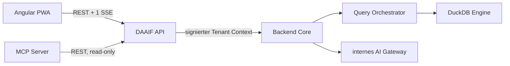

# DAAIF

DAAIF ist die Zielarchitektur-Nachfolgerin des bisherigen Proofs-of-Concept. Das Monorepo trennt Benutzeroberfläche, öffentliche API, fachliches Backend und MCP-Zugang in unabhängig baubare Images. Die erste vertikale Scheibe ist ausführbar: Katalog lesen, Datenprodukte und Kurationshistorie anzeigen, DuckDB-SQL ausführen und SQL über ein internes AI Gateway oder sichere Fallback-Regeln optimieren.

> **Namenskonvention:** Nur das GitHub-Repository heißt aus Camouflage-Gründen `fiaad`. Produkt, Anwendung, Services, Packages, Images, Protokolle und Konfiguration heißen durchgängig **DAAIF**.

## Schnellstart unter Windows

Das Repository ist für den gewünschten lokalen Zielpfad vorbereitet:

```powershell
Set-Location C:\Users\braya\apps\BIT
git clone https://github.com/svabra/fiaad.git
Set-Location .\fiaad
Copy-Item .env.example .env
docker compose up --build
```

Danach stehen bereit:

| Dienst | URL | Zweck |
| --- | --- | --- |
| Angular PWA | <http://localhost:8080> | Workbench, Offline-Lesemodus, Statusanzeige |
| API / OpenAPI | <http://localhost:8000/docs> | Öffentliche REST- und SSE-Verträge |
| MCP Server | <http://localhost:8002/mcp> | Streamable-HTTP-Zugang für MCP-Clients |
| Backend | nur internes Compose-Netz | Katalog, Orchestrierung, DuckDB, AI Gateway |

Die lokalen Demo-Identitäten sind absichtlich nur im Entwicklungsmodus aktiv. Vor einem nicht-lokalen Deployment müssen die Secrets ersetzt und `DAAIF_API_AUTH_MODE` auf einen verifizierten Gateway-/OIDC-Modus umgestellt werden.

## Monorepo

```text
fiaad/                   Repository-/Arbeitsverzeichnisname
├── apps/
│   ├── frontend/      Angular 22 PWA; ein multiplexter SSE-Client
│   ├── api/           öffentliches FastAPI Edge/API-Tier
│   ├── backend/       Use Cases, QueryOrchestrator, DuckDB-Adapter
│   └── mcp-server/    read-only MCP-Werkzeuge über die DAAIF API
├── docs/              Architektur, Mandantenfähigkeit, AI und ADRs
├── infra/             Deployment-Bausteine
├── scripts/           lokale Startskripte
└── compose.yaml       vollständiger lokaler Stack
```

## Laufzeitarchitektur



Heute sind Backend Core, Query Orchestrator und Query Engine gemeinsam in einem Image, aber über Ports und unveränderliche Request/Result-Modelle getrennt. Die spätere Verteilung ersetzt nur den In-Process-Adapter durch einen Remote-/Queue-Adapter. Details: [Architektur](docs/architecture.md).

## Umgesetzte Funktionen

- Angular-22-Oberfläche in der visuellen Sprache des bisherigen PoC
- installierbare PWA mit gecachtem App-Shell
- automatische PWA-Aktualisierung nach dem DACA-Muster: sichere Startaktualisierung, Interaktionsschutz, manueller Bestätigungsdialog und Reload-Loop-Guard
- mandantenspezifischer IndexedDB-Cache für erfolgreiche GET-Antworten
- lokal gespeichertes letztes Query-Resultat je Mandant
- permanent sichtbarer Online-/Offline-/SSE-Zustand
- genau ein SSE-Service pro laufendem PWA-Client; Topics werden über diesen Kanal multiplexiert
- öffentliche API mit Tenant Context und signiertem internem Service-Context
- read-only DuckDB-Ausführung mit Relation-Allowlist und Dateisystem-/Netzwerk-Sperren
- SQL-Optimierung über ein OpenAI-kompatibles internes Gateway
- validierter Regel-Fallback, falls das AI Gateway nicht konfiguriert oder nicht erreichbar ist
- textuelle Begründung, wahrscheinliche Fragestellung, Unified Diff und visuelles Zeilen-Diff
- MCP-Tools für Quellentypen, Quellen, Datenprodukte und Kurationshistorie
- vier unabhängig baubare Container-Images

## Produktfunktionalität und Migrationsstand

Diese Tabelle ist die Produktübersicht. Der detaillierte, fortzuschreibende Entwicklungsplan steht in [DEV_STATUS.md](DEV_STATUS.md).

| Funktionsbereich | Produktfunktionalität | Stand | Aktuelle TODOs |
| --- | --- | --- | --- |
| Zielarchitektur | Getrennte Tiers und Images für Angular-PWA, API, Backend und MCP; Backend intern über Ports aufteilbar | **Umgesetzt (Basis)** | Remote-Adapter und Protokoll für separaten Query Orchestrator/Engine festlegen |
| Übersicht | Kennzahlen, letzte Kurationen und fachlicher Einstieg | **Umgesetzt (Demo-Daten)** | Persistenten Katalog anbinden; Lade-/Fehlerzustände und Detailnavigation ergänzen |
| Datenquellenkatalog | Quellentypen, Quellen, Fähigkeiten, Owner und Status anzeigen | **Umgesetzt (Seed-Daten)** | Reale Discovery für S3, PostgreSQL und Oracle migrieren |
| Datenprodukte | Kuratierte/publizierte Produkte, Qualität, Herkunft und Kurationshistorie anzeigen | **Teilweise** | Erstellung, Vorschau, Versionierung, Überschreiben und DACA-Publikation migrieren |
| Query Studio | Read-only SQL gegen tenant-isoliertes DuckDB ausführen und Resultate darstellen | **Umgesetzt (Basis)** | Notebook-Baum, Multi-Cell-Editor, Run-History, Explain, Cancel und Exporte migrieren |
| SQL-Optimierung | Query per AI Gateway oder Regel-Fallback optimieren; Erklärung, Fragestellung und Text-/Visual-Diff liefern | **Umgesetzt (Basis)** | Realen BIT-Gateway-Vertrag, Policy/Audit und Qualitäts-Evaluation integrieren |
| Datenaufnahme | CSV, ZIP, JSON, XLSX, XML und Parquet validieren, konvertieren und als Query-Quelle übergeben | **Geplant** | Legacy-Ingestion als ersten vollständigen vertikalen Slice portieren |
| Datenquellen-Explorer | Lokalen Workspace, S3, PostgreSQL und Oracle durchsuchen und Quellen in Queries übernehmen | **Geplant** | Source Ports, Credential Broker, Explorer-API und Angular-Tree implementieren |
| Notebooks und Pipelines | Lokale/geteilte Notebooks, Versionen, Drag-and-drop-Baum, SQL-/Python-Stufen und materialisierte Resultate | **Geplant** | Domainmodell und API-Verträge entkoppelt aus dem PoC übertragen |
| Data Exchange | Dateien hoch-/herunterladen, verschieben und als Quelle verwenden | **Geplant** | Tenant-isolierte Storage-Pfade, Policies und Transfer-Jobs implementieren |
| Realtime | Query- und Systemereignisse über genau eine multiplexte SSE-Verbindung pro Client | **Umgesetzt (Basis)** | Persistenten Event-Bus, Resume/Replay und Job-Fortschritt ergänzen |
| Offline/PWA | App-Shell, tenant-spezifischer IndexedDB-Lesecache, letztes Query-Resultat und sichtbarer Verbindungsstatus | **Teilweise** | TTL/Klassifizierung, Verschlüsselung, Quota-UX und Cross-Tenant-Negativtests ergänzen |
| Automatische App-Aktualisierung | Neue Angular-Builds werden erkannt; unberührter Start aktualisiert automatisch, laufende Arbeit nur nach Bestätigung | **Umgesetzt** | A/B-PWA-Browsertest in CI und zentralen Release-Versionierungsjob ergänzen |
| Angular Evergreen | Angular und Toolchain kontrolliert aktuell halten | **Geplant** | Regelmässigen `ng update`-Workflow mit CI, Review und Rollback-Regel einrichten |
| MCP | Read-only Fragen zu Quellen, Produkten und Kurationshistorie über Streamable HTTP beantworten | **Umgesetzt (Basis)** | OAuth/Token Exchange, Tool-Audit und produktive Tenant-Zuordnung integrieren |
| Mandantenfähigkeit | Tenant Context durch API/Backend, getrennte Caches, DB-Pfade und Events | **Teilweise** | OIDC, Policy Engine, RLS-Katalog, Quotas, Secrets und Isolationstests produktionsreif machen |
| Betrieb | Compose, Health/Ready, CI und vier Images | **Umgesetzt (Basis)** | Observability, SBOM/Scanning, K8s-Deployment, Backup/Restore und SLOs ergänzen |

Statusbedeutung: **Umgesetzt** ist ausführbar und getestet, aber nicht automatisch produktionsreif; **Teilweise** deckt nur einen Teil des Legacy-Umfangs ab; **Geplant** ist noch nicht in der Zielarchitektur implementiert.

## AI Gateway konfigurieren

In `.env`:

```dotenv
DAAIF_AI_GATEWAY_BASE_URL=https://ai-gateway.intern.example
DAAIF_AI_GATEWAY_API_KEY=replace-me
DAAIF_AI_GATEWAY_MODEL=sql-optimizer
```

Der Adapter erwartet zunächst einen OpenAI-kompatiblen Endpunkt `/v1/chat/completions`. Diese Annahme ist in einer Infrastrukturklasse gekapselt und kann gegen den effektiven BIT-Gateway-Vertrag ausgetauscht werden. An das Gateway gehen nur SQL, Dialekt und expliziter Schema-Kontext – keine Query-Resultate oder Datenzeilen. Jede zurückgegebene Query durchläuft nochmals dieselbe Read-only-Validierung.

## Entwicklung ohne Container

```bash
python -m venv .venv
# Windows: .\.venv\Scripts\Activate.ps1
# Linux/macOS: source .venv/bin/activate
python -m pip install -r requirements-dev.txt

PYTHONPATH=apps/backend/src uvicorn daaif_backend.main:app --port 8001 --reload
PYTHONPATH=apps/api/src uvicorn daaif_api.main:app --port 8000 --reload
npm --prefix apps/frontend start
```

Separat für den MCP-Server:

```bash
PYTHONPATH=apps/mcp-server/src python -m daaif_mcp.main
```

## Tests

```bash
python -m pytest
npm --prefix apps/frontend test -- --watch=false
npm --prefix apps/frontend run build
docker compose config
```

## Wichtige Grenzen dieser ersten Zielarchitektur-Scheibe

- Der Katalogadapter liefert derzeit mandantenspezifische Seed-Daten. Der Port ist für eine persistente, per Row-Level-Security isolierte Metadatenbank vorbereitet.
- Lokale Authentisierung ist eine Demo. Der spätere Plattform-Orchestrator muss signierte Identitäts-/Tenant-Claims liefern.
- DuckDB läuft jetzt im Backend-Prozess. Der Code-Schnitt für einen getrennten Orchestrator und Engine-Worker ist vorhanden; verteilte Queue, Result-Object-Storage und Cancel-Protokoll sind die nächste Ausbaustufe.
- Offline ist bewusst read-only. SQL-Ausführungen und Optimierungen werden nicht blind gequeued und später unbemerkt ausgeführt.

Siehe [Mandantenfähigkeit](docs/multitenancy.md) für die vollständige Bedeutung und die noch vom Plattform-Orchestrator zu erfüllenden Anforderungen. Der [MCP-Betrieb](docs/mcp-server.md) beschreibt die vorhandenen Tools und den Übergang vom lokalen festen Tenant zu OAuth/Token Exchange.
