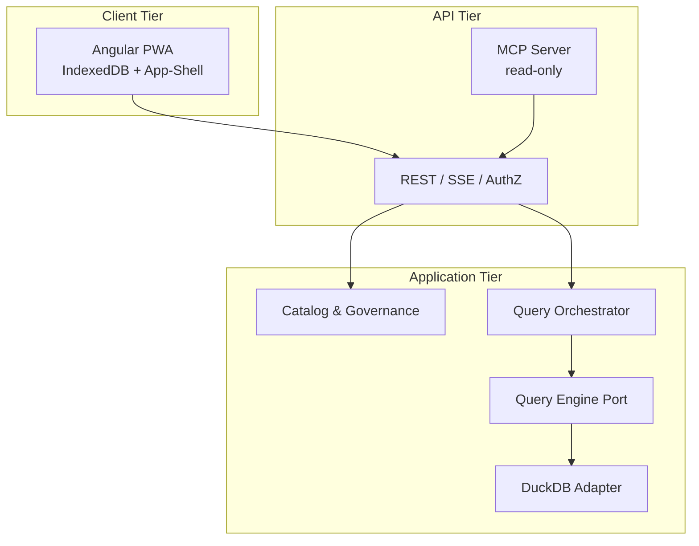
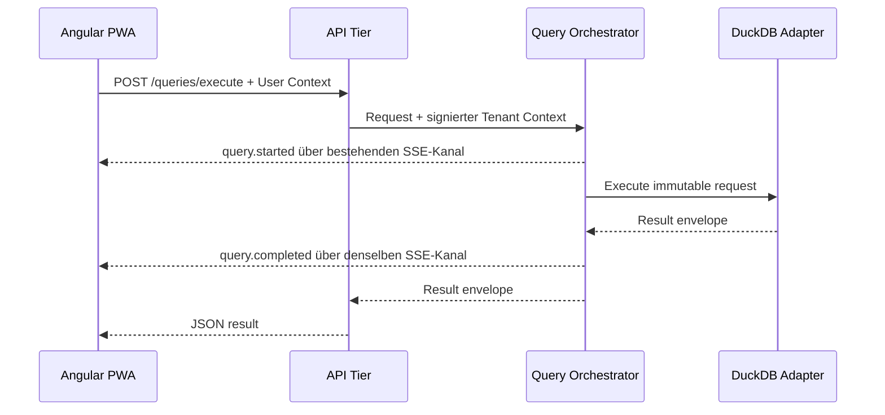

# DAAIF Zielarchitektur

## Architekturprinzip

DAAIF ist eine mandantenbewusste n-tier-Anwendung. Deploybare Grenzen und fachliche Grenzen sind absichtlich nicht identisch: Das Backend startet als modularer Monolith, besitzt aber schon die Ports, Nachrichten und Ownership-Grenzen für eine spätere Aufteilung. So vermeiden wir einen verteilten Monolithen, ohne die Migration zu blockieren.

## Verantwortungen

| Baustein | Besitzt | Besitzt ausdrücklich nicht |
| --- | --- | --- |
| Frontend | UX, lokale Entwürfe/Resultate, PWA-Shell, ein SSE-Client | Autorisierung, kanonische Metadaten, Server-Query-State |
| API | externe Verträge, AuthN/AuthZ-Hook, Tenant Context, Rate-/Policy-Grenze, SSE-Proxy | DuckDB, fachliche Kuration, AI-Prompts |
| Backend Core | Katalog- und Governance-Use-Cases, Audit, Ports | Browserzustand, externes Auth-Protokoll |
| Query Orchestrator | Job-ID, Lifecycle, Routing, Timeouts, Events | SQL-Engine-Implementierung, UI |
| Query Engine | validierte Ausführung, Limits, Result-Envelope | Endnutzeridentität, HTTP-Verträge |
| MCP Server | MCP-Schemata und read-only API-Komposition | direkter Datenbank-/Backend-Zugriff |

## Request- und Event-Fluss

Der HTTP-Response liefert die Daten. SSE liefert Status, Fortschritt und später Cancel-/Worker-Ereignisse. Beide Pfade teilen dieselbe `query_id` und `correlation_id`.

## Vorbereitete Backend-Aufteilung

Phase 1 (dieses Repository):

- `CatalogService`, `QueryOrchestrator` und `DuckDbQueryEngine` laufen in einem Backend-Container.
- Der Orchestrator hängt ausschließlich am `QueryEngine`-Protocol.
- `TenantEventBroker` ist in-memory, aber tenant-gefiltert.

Phase 2:

- `QueryOrchestrator` wird eigener Service.
- `QueryEngine` wird Remote-Adapter zu Queue/gRPC/HTTP.
- NATS/Kafka/Redis Streams ersetzt den In-Memory-Broker.
- Große Resultate wandern in tenant-separierten Object Storage; HTTP liefert signierte, kurzlebige Referenzen.

Phase 3:

- Worker Pools nach Engine-/Datenquellentyp.
- Quotas, Prioritäten, Backpressure, Cancel und idempotente Wiederaufnahme.
- Optionale regionale oder klassifizierungsbasierte Worker-Zuordnung.

## Daten- und Sicherheitsgrenzen

- Browser spricht nie direkt mit Backend oder DuckDB.
- MCP spricht nie direkt mit Backend oder Speicher.
- API erzeugt einen kurzlebigen, signierten internen Context mit `tid`, `sub`, `roles`, `cid`, `aud`, `iss` und `exp`.
- Backend vertraut keinen frei gesetzten Tenant-Headern.
- DuckDB-Pfade werden aus einem Hash der validierten Tenant-ID abgeleitet.
- SQL ist auf eine einzelne read-only-Anweisung und explizit freigegebene Relationen begrenzt. Datei-, URL-, Extension- und DDL/DML-Funktionen sind gesperrt.
- Produktionsbetrieb soll HMAC durch asymmetrisch signierte Service-Tokens plus mTLS ersetzen.

## Offline- und Realtime-Modell

Angulars Service Worker installiert die versionierte Anwendung als Einheit. API-Daten werden absichtlich nicht durch einen header-blinden CacheStorage-Schlüssel gecacht, weil derselbe URL-Pfad für verschiedene Mandanten sonst kollidieren könnte. Stattdessen speichert ein Angular-Interceptor erfolgreiche GET-Antworten in IndexedDB unter `tenant_id + URL`.

Query-POST-Responses werden explizit als letztes Resultat pro Tenant gespeichert. Offline sind nur Lesen, Navigation und gespeicherte Ergebnisse erlaubt. Mutationen, Query-Ausführung und AI-Aufrufe werden nicht automatisch in eine Outbox gelegt.

Ein Singleton `RealtimeService` hält pro laufendem PWA-Client genau einen SSE-Fetch-Stream. `query.*`, `catalog.*` und künftige Topics werden darin multiplexiert. Reconnect verwendet exponentielles Backoff; Heartbeats laufen serverseitig über denselben Stream.

